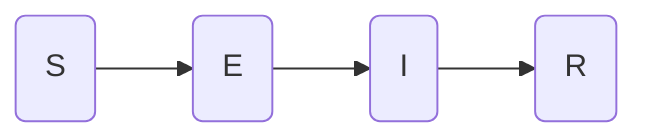

# SEIR model for COVID-19 simulations

These files implement a few models for infectious diseases based on the classical SEIR model.  The program is based on different modules that allow the user to define and save the parameters necessary to reproduce a particular simulation in the form of a dictionary recording each option.  All models are variations on the two basic models described below.

## Basic models

The SEIR models assume that people move along four compartments: `S`, for susceptibles, `E`, for susceptibles that were exposed to the disease, `I`, for those exposed that are now able to infect others, and `R` for recovered (or dead).  This initial model assumes recovered people remain immune to new infections.



1. Continuous-time deterministic SEIR

   The base of all the implemented continuous-time, deterministic models is the SEIR model defined by the equations
   $$
   \frac{d S}{dt} = -\beta \frac{IS}{N},\\
   \frac{dE}{dt} = \beta\frac{IS}{N} - \sigma E,\\
\frac{d I}{dt} = \sigma E - \mu I,\\
   \frac{dR}{dt} = \mu I.
   $$
   

where $S(t)$ is the number of susceptible people at time $t$, $E$ is the number of exposed people (that have contracted the disease, but are not yet contagious), $I$ is the number of infected people (that are contagious), and $R$ is the number of recovered or dead.  Parameter $\beta$ is the contact rate, that is, the rate at which an infected person infects susceptibles, $\sigma$ is the incubation rate ($\tau_\sigma = 1/\sigma$ is the average incubation time), $\mu$ is the recovery rate ($\tau_\mu = 1/\mu$ is the average recovery time).

2. Discrete-time stochastic SEIR[^Lekone2006]

   $$
   S(t+\Delta t) = S(t)-\Delta S,\\
   E(t+\Delta t) = E(t) + \Delta S - \Delta E,\\
   I(t+\Delta t) = I(t) + \Delta E - \Delta I,\\
   R(t + \Delta t) = R(t) + \Delta I,
   $$
   where $\Delta t$ is the step size for the simulation, and the increments $\Delta S$, $\Delta E$ and $\Delta I$ follow binomial distributions 
   
    $\Delta S\sim \text{Bin}(S(t), p_{\text{exp}})$, $\Delta E \sim \text{Bin}(E(t), p_{\text{inc}})$, $\Delta I(t) \sim \text{Bin}(I(t), p_{\text{rec}})$ with exposure, incubation and recovery probabilities given by
   $$
   p_{\text{exp}} = 1 - e^{-\frac{\beta(t)}{N}\Delta t I(t)},\\
   p_{\text{inc}} = 1 - e^{-\sigma\Delta t},\\
   p_{\text{rec}} = 1 - e^{-\mu \Delta t}.
   $$
   

## Augmented models

Several features were added to these basic models:

1. A function $\alpha(t)$ that multiplies $\beta$, to form a simple model for the effect of non-pharmaceutical interventions (NPIs), such as social distancing, use of masks, school closures, etc.

2. The division of each compartment, $S$, $E$, $I$, $R$, into several subcompartments  each for a different age group (so that $S$, $E$, $I$ and $R$ are now vectors with dimensions equal to the number of age groups).  The interactions between age groups is described by a contact matrix $A$, such that
   $$
   \frac{dS}{dt} = - A^T I \odot \frac{S}{N}
   $$
   for the continuous model.  For the discrete model, the exporsure probability now depends on the age compartments, and becomes vector such that
   $$
   p_{\text{exp}} = 1 - \exp.\left(-A^T \frac{I}{N} \Delta t\right),
   $$
   where $\exp.(x)$ should be understood as a broadcast in Julia, that is, a element-by-element operation.

   The contact matrix can depend on time.  In particular, if the contact matrices from[^Prem2020] are used, which provides separate contact matrices for home, school, work, and others, NPI measures such as closing of schools can be taken into account in the simulations.

3. The division of each compartment into _activity level_ groups to allow the introduction of dispersion[^Lloyd-Smith2005] .  Each activity level subgroup corresponds to a different number of contacts for that subgroup.  This difference in number of contacts corresponds to the individual reproductive number $\nu$ described in [^Lloyd-Smith2005], and can be defined either in an ad-hoc manner, as described in [Britton, 2020], or using a gamma distribution, adapting the proposal in [^Lloyd-Smith, 2005].

   Note that age and activity groups can be used simultaneously.

4. Possibility of loss of immunity and seroreversion (i.e., loss of antibodies in pacients that have recovered).  The model was implemented by splitting `R` in three new compartments: `Rsp`, for recovered that do not serorevert, `Rsn`, for recovered that do serorevert, but do not lose immunity, and `Rl`, for recovered that serorevert and lose immunity.  The probability of seroreversion is $\epsilon_0$, and the probability of immunity loss, *given seroreversion*, is $p_0$ (so that the total probability of immunity loss is $\epsilon_0 p_0$.)  The rate at which people lose immunity is $a_r$.  There is also a new susceptible compartment, `Sr`, for susceptibles that have been infected at least once before (this allows the user to count the total number of infected in an outbreak.)

   ```mermaid
   graph LR
   S(S) --> E(E)
   E --> I(I)
   I --> |1-ϵ0| Rsp(Rsp)
   I --> |"(1-p0)ϵ0"| Rsn(Rsn)
   I --> |p0ϵ0| Rl(Rl)
   Rl --> Sr(Sr)
   Sr --> E
   
   ```

   

5. Entry of a second virus lineage after a certain date. The second variant may (or not) partially evade immunity conferred by the first variant. Those recovered from infection by the first variant may (or not) lose immunity.
   
   ```mermaid
   graph LR
   
   S(S) --> E(E)
   E --> I(I)
   I --> |1-p0-p1| Rsp(Rsp)
   I --> |p1| Rvar(Rvar)
   I --> |p0| Rl(Rl)
   Rvar --> Svar(Svar)
   Rl --> Sr(Sr)
   Sr --> E
   S --> Evar
   Sr --> Evar
   Svar --> Evar
   Evar --> Ivar(Ivar)
   Ivar --> Rsp
   ```
   
   $$
   \frac{d S}{dt} = -A^TI \odot \frac{S}{N},\\
   \frac{dE}{dt} = A^TI \odot\frac{S+S_r}{N} - \sigma E,\\
   \frac{d I}{dt} = \sigma E - \mu I,\\
   \frac{dR_{sp}}{dt} = (1-p_0-p_1)\mu I + \mu I_{var},\\
   \frac{dR_L}{dt} = p_0\mu I - a_R R_L,\\
   \frac{dR_{var}}{dt} = p_1 \mu I - a_{R1} R_{var},\\
   \frac{dS_r}{dt} = a_{R1} R_{var} - A^T I\odot\frac{S_r}{N} - f A^T I_{var}\odot\frac{S_r}{N},\\
   \frac{dE_{var}}{dt} = fA^TI_{var}\odot\frac{S_r}{N}-\sigma E_{var},\\
   \frac{dI_{var}}{dt} = \sigma E_{var}-\mu I_{var}.
   $$
   
6. A fractal model adapting [^Abbasi2020] was also included, changing the update equations to
   $$
   \frac{dS}{dt} = - A^T I(0)^{1-q}I(t)^q \odot\frac{S}{N},
   $$
   where $q$ is a parameter associated to Tsallis statistics.  The discrete-time model was similarly modified.

## Preparing a simulation

Before running a simulation, the user must define which model (continuous-time, discrete-time, with or without seroreversion), and which set of parameters to use. The options for the simulations are chosen through a dictionary, with is used by several functions to define the parameters of a particular simulation.  Saving the values of this option dictionary provides a simple way of reproducing the same simulation again.

The structure of the dictionary is (note that some options can be given as a Julia `Symbol`, as `:Population => :Manaus`, to be converted to values in special functions to be explained later, or directly as numerical values, as `:Population => 2_219_580` ).

```{julia}
:Simulation_Name => begin
  	Dict(:Model => :SEIRDiscrete,   # Solver - continuous or discrete-time
            :Population => :Manaus, # Total population for this simulation
            :FirstDay => :Manaus,   # Day corresponding to `t=0` in the simulation 
            :R0 => :SP,						  # The value of the base (average) R0 
            :NPI => :None,				  # Will NPI information be used?
            :RecoveryRate => :BrittonScience2020, # Recovery rate μ
            :IncubationRate => :BrittonScience2020, # Incubation rate σ
            :AgeStructure => :None,  # Should age structure of the population be used?
            :ContactMatrix => :None, # Choice of contact matrix between age groups
            :ActivityVector => :Superspreaders, # Individual contact number distribution ν among people of same age group
            :ActivityStructure => :Superspreaders, # Frequency of each contact number group
            :Dispersion => :None, # Choice of dispersion factor k for the simulation
            :q => 0.13,           # Fractal index
            :N0 => 100,           # Number of initial infected patients in the population
            :InitCond => :Discrete, # Choice of initial condition for the simulation
            :StepSize => :QuarterDay # Step size
            :Quarantine => :None,  # Uses time-varying contact matrix considering NPIs
            :LossImmRate => :None, # Rate of loss of immunity
            :SeroRevProb => :None, # Probability of seroreversion
            :LossImmProb => :None  # Probability of loss of immunity given that patient seroreverted
  			)
end
```

We shall give details of all these options in the following.

### Model choice

The choices for `:Model` are: 

* `:SEIRAgeContinuous`: deterministic, continuous-time model, including the possibility of age structure and different activity levels.
* `:SeroRevContinuous`: as before, but with the possibility of seroreversion and loss of immunity.
* `:SEIRDiscrete`: stochastic, discrete-time model including the possibility of age structure and different activity levels.
* `:SEIRSeroRevDiscrete`: as above, but with the possibility of seroreversion and loss of immunity.
* `:SEIRNewVariantDiscrete`: discrete model with two variants, immunity against first variant protects also against second variant.
* `:SEIRSeroRevNewVariantDiscrete`: as above, but immunity against first variant may stop protecting against second variant after a while.  Immunity against the first variant may also wane gradually.

The model is chosen by calling function `model`:

```julia
md,πv,A,p,u0 = model(caseopt)
```

where `caseopt`is the options dictionary, `md` is the solver function, `πv` is a vector with the fraction of people in different age and activity compartment, `A`is a vector of contact matrices, `p` is a dictionary described below, and `u0` is a vector with the initial conditions.

Note that `A` is a vector of contact matrices, that is, `A[1]` is a contact matrix.  If the contact matrices from[^Prem2020] are used, `A[1]` is the contact matrix for home, `A[2]` for school, `A[3]` for work, and `A[4]` for others.  The overall contact matrix is simply the sum of the four: `Afull = sum(A)`.  Models considering quarantine and other NPIs will compute a contact matrix for each day, considering for example school closures (`A(t) = A[1] + A[3] + A[4]`), and/or measures of mobility `α(t)` obtained from cellular phone data (`A(t) = A[1] + α(t) (A[3] + A[4])`), and so on. 

The dictionary `p` contains information about the simulation computed from the options dictionary:

| Entry                                                        | Value                                                        |
| ------------------------------------------------------------ | ------------------------------------------------------------ |
| `:S`, `:E`, `:I`, `:R` (and in seroreversion and multi-variant models, also `:Sr`, `:Rsp`, `:Rsn`, `:Rl`, `:Svar`, `:Evar`, `:Ivar`, `:Rvar`) | Ranges of indices for each compartment: `p[:S]` are the indices used for the `S`compartment, and so on. |
| `:ContactMatrix`                                             | Function handle to compute $A(t)^T I(t)$ at each instant.  The function is called as `p[:ContactMatrix](t, i)`, and returns `A(t)'*i`.  Note that if `:q < 1`, the function call is actually `p[:ContactMatrix](t, i.^q)`, and the function returns `I(0).^(1-q) * A(t)' * I(t).^q`. |
| `:Population`                                                | Total population for the simulation                          |
| `:IncubationRate`                                            | Value of `σ`.                                                |
| `:RecoveryRate`                                              | Value of `μ`.                                                |
| `:SeroRevProb`                                               | Value of `ϵ0`.                                               |
| `:LossImmProb`                                               | Value of `p0.`                                               |
| `:LossImmRate`                                               | Value of `ar`.                                               |
| `:NPI`                                                       | Handle to function that returns a factor `α(t)` that is multiplied to the contact matrix at time `t` to account for NPI measures. |
| `:LossImmProbVar`                                            | Value of `p1`                                                |
| `:LossImmRateVar`                                            | Value of `ar1`                                               |
| `:TimeIntroduction`                                          | Time in which the new variant appears (in days after the beginning of the simulation) |
| `:N0var`                                                     | Number of cases of new variant at `p[:TimeIntroduction]`     |
| `:R0fac`                                                     | The reproduction number of the second variant is `p[:R0fac]*R0`, where `R0` is the reproduction number for the first variant |
| `:PopDistribution`                                           | Vector describing the distribution of the population among each age range (must add up to 1.0) |
| `:StepSize`                                                  | Time step used in the simulation (in days)                   |

## Running a model

In order to run a model, use the code

### Continuous time

```julia
tspan = (tinit, tend)
prob = ODEProblem(md, u0, tspan, p)
sol = solve(prob, Tsit5(), reltol = rtol, abstol = atol)
```


### Discrete time

```julia
tspan = (tinit, tend)
md,πv,A,p,u0 = model(caseopt)
u, t = discretesolve(u0, md, p, tspan)
```

Vector `u` is a vector of vectors, such that `u[1]` is the initial condition, `u[2]` is the output at `t[2]`, and so on.  Each `u[n]` contains the number of people in each compartment at time `t[n]`.  In order to add all the subcompartments related to the susceptibles and exposed at each time instant, use function `sumind`:

```julia
s = sumind(u, p[:S])
e = sumind(u, p[:E])
```

Vector `t`  can be converted to dates using

```julia
d0 = firstday(case) # Day corresponding to t = 0
d = DateTime(d0) .+ Second.(round.(Int, t * 24 * 3600))
```

[^Lekone2006]: Lekone and Finkenstädt, "Statistical inference in a stochastic epidemic SEIR model with control intervention: Ebola as a case study", _Biometrics_ vol. 62, Dec. 2006.
[^Prem2020]: K. Prem *et al.*, “Projecting contact matrices in 177 geographical regions: an update and comparison with empirical data for the COVID-19 era,” *medRxiv*, p. 2020.07.22.20159772, Jul. 2020, doi: [10.1101/2020.07.22.20159772](https://doi.org/10.1101/2020.07.22.20159772).
[^Lloyd-Smith2005]: Lloyd-Smith et al., Superspreading and the effect of individual variation on disease emergence, Nature, 2005, and Britton et al, A mathematical model reveals the influence of population heterogeneity on herd immunity to SARS-CoV-2, Science, 2020.
[^Abbasi2020]: M. Abbasi et al., “Fractal signatures of the COVID-19 spread,” Chaos, Solitons & Fractals, vol. 140, p. 110119, Nov. 2020, doi: 10.1016/j.chaos.2020.110119.


